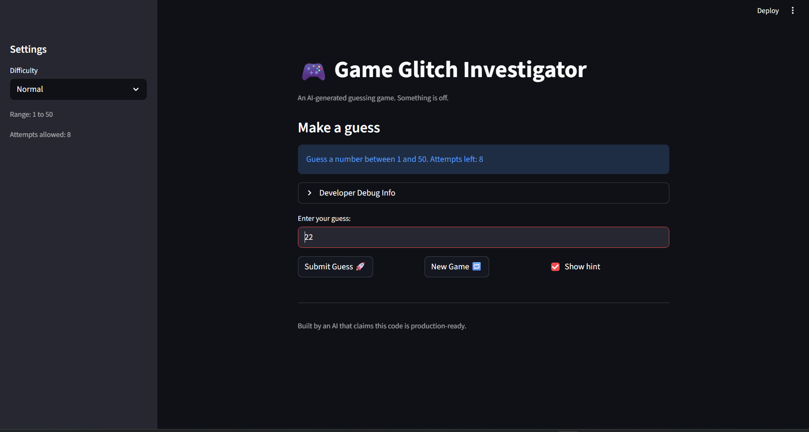

# 🎮 Game Glitch Investigator: The Impossible Guesser

## 🚨 The Situation

You asked an AI to build a simple "Number Guessing Game" using Streamlit.
It wrote the code, ran away, and now the game is unplayable. 

- You can't win.
- The hints lie to you.
- The secret number seems to have commitment issues.

## 🛠️ Setup

1. Install dependencies: `pip install -r requirements.txt`
2. Run the broken app: `python -m streamlit run app.py`

## 🕵️‍♂️ Your Mission

1. **Play the game.** Open the "Developer Debug Info" tab in the app to see the secret number. Try to win.
2. **Find the State Bug.** Why does the secret number change every time you click "Submit"? Ask ChatGPT: *"How do I keep a variable from resetting in Streamlit when I click a button?"*
3. **Fix the Logic.** The hints ("Higher/Lower") are wrong. Fix them.
4. **Refactor & Test.** - Move the logic into `logic_utils.py`.
   - Run `pytest` in your terminal.
   - Keep fixing until all tests pass!

## 📝 Document Your Experience

- [ ] Describe the game's purpose.
      The game's purpose is to make the user guess a number between a range within a given number of attempts
- [ ] Detail which bugs you found.
      1. The new game button does not seem to be working, it should reset the attempts and make the user play again.
      2. The hint given is opposite to what actually is true. 
      3. The number range doesn't change with change in difficulty. 
      4. Also the attempts don't match with the ones given in the setting panel.
- [ ] Explain what fixes you applied.
      For the button I just made the attempts reset after every click.
      for the hint I just change lower to higher and higher to lower.
      For the number range part I made the low and high of the range dynamic based on the difficulty given rather than just 1-100.
      Lastly I made the attempts match the one on the setting panel 

## 📸 Demo

- [ ] []

## 🚀 Stretch Features

- [ ] [If you choose to complete Challenge 4, insert a screenshot of your Enhanced Game UI here]
